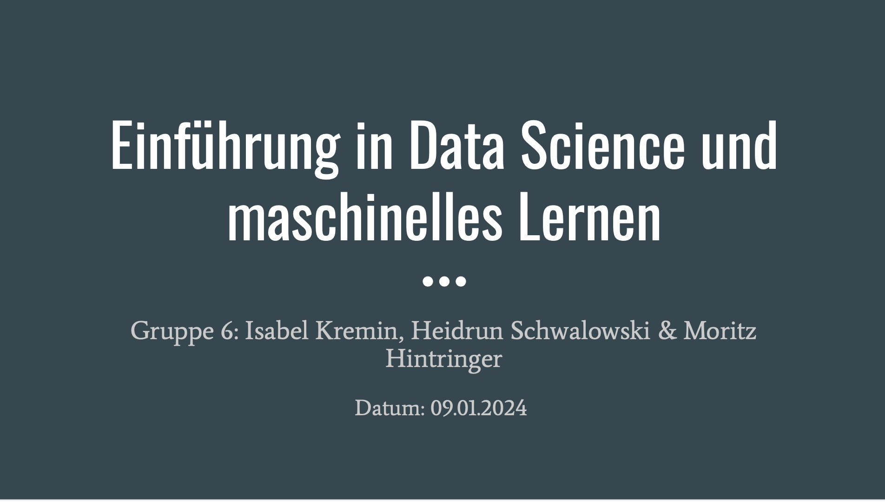

# Sales Forecasting for a Bakery Branch

## Repository Link

https://github.com/Heidikowski/Bakery-Project

## Description

This project focuses on sales forecasting for a bakery branch, utilizing historical sales data spanning from July 1, 2013, to July 30, 2018, to inform inventory and staffing decisions. We aim to predict future sales for six specific product categories: Bread, Rolls, Croissants, Confectionery, Cakes, and Seasonal Bread. Our methodology integrates statistical and machine learning techniques, beginning with a baseline linear regression model to identify fundamental trends, and progressing to a sophisticated neural network designed to discern more nuanced patterns and enhance forecast precision. The initiative encompasses data preparation, crafting bar charts with confidence intervals for visualization, and fine-tuning models to assess their performance on test data from August 1, 2018, to July 30, 2019, using the Mean Absolute Percentage Error (MAPE) metric for each product category.

### Task Type

Regression

### Results Summary

-   **Best Model:** [neural_net_estimation.ipynb]
-   **Evaluation Metric:** MAPE
-   **Result by Category** (Identifier):
    -   **Bread** (1): [19.55]%
    -   **Rolls** (2): [13.53]%
    -   **Croissant** (3): [20.67]%
    -   **Confectionery** (4): [22.66]%
    -   **Cake** (5): [15.68]%
    -   **Seasonal Bread** (6): [44.82]%

## Documentation

1.  [**Data Import and Preparation**](0_DataPreparation/)
`Data/`includes all data sets that have been used in this project: 
- `train.csv`: contains bakery sales plus their IDs from 01-July 2013 to 31-July 2018
- `test.csv`: contains IDs for sales from 01-August 2018 to 30-July 2019
- `wetter.csv`: contains weather data
- `kiwo.csv`: contains Kieler Woche dates
- `wettercodes_one_hot.csv`: contains one-hot encoded weathercodes
- `Feiertage.csv`: contains national holidays in Schleswig-Holstein 

Further features that have been added to the model during the processing flow:
    - binned temperature, wind speed and cloud coverage
    - New Year's Eve
    - annual inflation rates

`Code/data_prep.ipynb` includes main code for data preparation. 
Our processing involves the following steps: 
    - merging the available datasets to one *pandas.DataFrame* 
    - missing value imputation (linear interpolation and KNN) 
    - binning of temperatures 
    - dummy-encoding of product groups, months and weekdays 
    - splitting data back to train (sales available, used for machine learning model) and test (sales not available) datasets 

2.  [**Dataset Characteristics (Barcharts)**](1_DatasetCharacteristics/)
`grafiken_umsatz.ipynb` includes main code for data analysis. 
The following methods have been used: 
    - descriptive statistic of data using *pandas.DataFrame.describe()* method 
    - graphical analysis of missing values by using *missingno.matrix()* 
    - histograms of numerical features and boxplot for sales 
    - correlation matrix of numerical features 
    - Graphical representation of different variables with influence on sales 

3.  [**Baseline Model**](2_BaselineModel/)
`baseline_model_final.ipynb` includes main code for baseline model. 
The following linear regression models have been tested on MAPE and adjusted R$²$: 
    - *statsmodels.api.OLS* 
    - *sklearn.linear_model.Ridge* plus hyperparameter tuning 
    - *sklearn.linear_model.SGDRegressor* 

4.  [**Model Definition and Evaluation**](3_Model/) 
`neural_net_estimation.ipynb` includes main code for machine learning model and plots. 
The following machine learning model has been used for bakery sales prediction: 
    - tool: tensorflow 
    - model architecture: 3 dense layers (128 - 128 -32 neurons), *relu* activation, batch normalization and 0.3 dropout 
    - loss: Huber 
    - learning rate: exponential decay 

5.  [**Presentation**](4_Presentation/README.md)

## Cover Image

